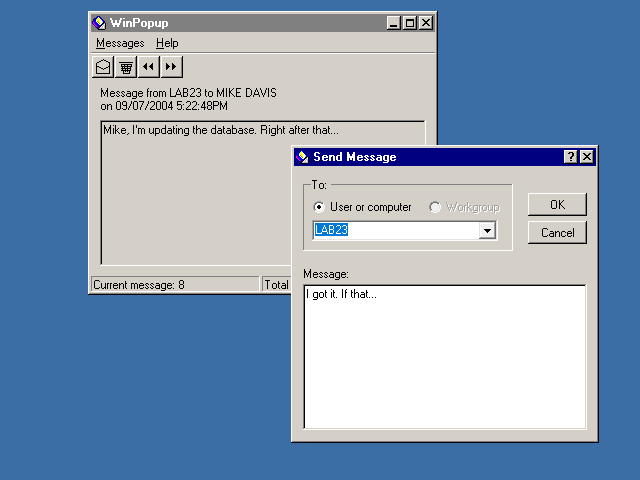
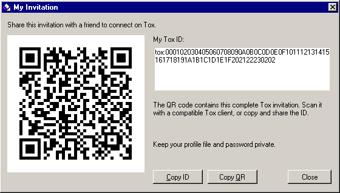
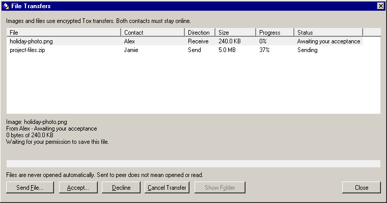

# WinPopup P2P

A small, portable Windows x64 messenger that recreates the classic WinPopup window and separate Send Message dialog, using the real Tox protocol. Version 0.3.0 uses the compact grey interface, blue title bars, bevelled buttons, bitmap-style type, four-button toolbar and message counters of the supplied classic reference. Native C++ / Win32 interface. No account, subscription, web service, installer, or server of your own.

## Download

[Download the portable Windows x64 release](https://github.com/amirhadzi/winpopup-p2p/releases/tag/v0.3.0). Extract the ZIP and run `WinPopup.exe`. The release also includes a standalone executable, a complete offline source package, and SHA-256 checksums.

This is a render of the production interface with test messages, not a live conversation.

## Upgrading from 0.1.0 or 0.2.0

Close the old app, then replace `WinPopup.exe` in your existing portable folder with this version. Keep your `data` folder and use the same password. Your encrypted identity and contacts remain compatible.

If you extract the new ZIP into a different folder, copy your existing `data` folder beside the new executable while both copies are closed. Do not run two copies using the same profile.

## Start a conversation

1. Extract the portable ZIP into a folder you can write to and run `WinPopup.exe`.
2. Choose your display name and a password for your portable identity.
3. Choose **Messages > Contacts > Copy My Invitation** and share it with your friend using a channel you already trust.
4. Your friend opens their own copy and chooses **Messages > Contacts > Add Contact**, pastes your invitation, and sends a request.
5. Approve the request. When you are both online, click the envelope toolbar button to open **Send Message**, choose your contact, type a message, and press **Ctrl+Enter** or **OK**.

The main window shows one received message at a time. Use the arrow toolbar buttons to browse and the delete button to remove the displayed message from this session. The status bar shows the current message and total message count. **Messages > Sent Messages** shows outgoing delivery status. Tox contact management and connection details are in the menus.

An invitation contains a public Tox ID, not a password. You can also exchange IDs with compatible Tox clients. Verify the full ID through a trusted channel when the identity of the person matters; display names are chosen by users.

## Invite QR codes

Choose **Messages > Contacts > My Invitation (QR Code)** to show your complete Tox invitation as both a QR code and selectable text. **Copy ID** retains the usual text workflow; **Copy QR** copies the QR image for pasting into another app. QR generation happens locally, with no QR service or account. The QR contains the same public `tox:` invitation, including its checksum. A QR reader or compatible Tox client can read it; WinPopup does not include a camera scanner.

This preview uses a synthetic test ID. Open your own app to share your actual invitation.

## Share images and files

Choose **Messages > Send File**, select an online contact, and choose an image or any other file. Pictures are transferred unchanged, without resizing or recompression. Both peers must remain connected. File sharing requires WinPopup 0.3.0 or newer at both ends; older WinPopup versions and other Tox clients can still exchange text.

**Messages > File Transfers** shows incoming offers, filenames, sizes, progress and status. The recipient chooses **Accept** and a new save location, or **Decline**. Transfers can be cancelled. Files are never accepted or opened automatically. **Show Folder** is available after an incoming file has been saved.

Transfers stream over the encrypted Tox connection, with up to 8 active files and a 2 GiB limit per file. Incoming data uses a private temporary file and is published to the chosen name only on completion; failed or cancelled partial files are removed. Existing files are never silently replaced: choose a new filename. Interrupted transfers must be sent again; they do not resume after disconnect or restart. Transfer history is session-only.

For outgoing files, completion means Tox delivered the bytes to the peer. For incoming files, **Saved** confirms that this app finished writing the destination. Neither status means someone opened the file. Received files are ordinary files at the location you chose; profile encryption does not encrypt those saved files.

## What “no infrastructure” means

There is no WinPopup service, registration database, central message store, or infrastructure for you to operate. The app joins the existing public Tox network using a small built-in list of discovery nodes. Tox attempts direct encrypted connections and can use encrypted TCP relays when direct connections are unavailable. Those volunteer nodes are infrastructure shared by the Tox network; this is not a promise of zero third-party involvement or universal firewall traversal.

The app shows network connectivity and each contact's connection type. “Direct” is a direct peer connection. “Relay” means the encrypted Tox transport is using a TCP relay. Tox peers can see network addresses; this is not an anonymity tool. Some corporate networks, VPNs, mobile networks, or firewalls may prevent connections. Both people need the app open and connected.

## Messages and portability

- **Delivery:** Sending means Tox accepted the message for an online contact. A delivery receipt confirms receipt by the peer's client, not that the person read it.
- **Offline contacts:** This version does not store an offline outbox or use store-and-forward servers. Reconnect before sending.
- **History:** Conversation history is kept in memory for this session only and is not saved as a plaintext log.
- **Identity:** Your encrypted Tox identity and contacts live beside the executable in `data/profile.tox`. Keep the entire folder together when moving the app, and close it before making a backup.
- **Password:** There is no password reset service. Keep your password and an offline backup of your profile. Losing either can mean losing access to that identity.
- **Privacy:** The app uses Tox encryption in transit and the standard Tox encrypted-save format on disk. It does not include analytics, ads, automatic updates, or cloud backup.

This version supports one-to-one text, image and file sharing. The classic **Workgroup** control is retained for visual familiarity but is disabled: Windows workgroups are not Tox groups. Voice, video, group chat, history sync, and offline delivery are outside its scope. It is a development build, not an independently audited product.

## Windows requirements

64-bit Windows 10 or Windows 11. The application is built with a statically linked C++ runtime; no .NET, Electron, or separately installed Visual C++ runtime is required. It runs without administrator privileges and does not add services, scheduled tasks, registry startup entries, or firewall rules.

The build is unsigned. Windows may show an unfamiliar-publisher notice. This project does not change Windows security settings.

If Windows or folder permissions prevent creating the portable `data` folder, move the extracted application to a writable folder, such as Downloads. Keep Windows security protections enabled. A profile that is already open in another copy cannot be opened twice at the same time.

## Build and test

See [BUILDING.md](app/BUILDING.md). To build this repository, run `deps/build-dependencies.ps1`, then `app/build.ps1 -Test` in PowerShell with Visual Studio 2022 C++ tools installed. The dependency script downloads and verifies the pinned upstream inputs. The release source ZIP also includes those inputs and static libraries for offline builds. It includes the application source, pinned third-party source inputs, build scripts, and license notices. `core_tests` exercises real Tox instances, contact approval, Unicode messages, delivery receipts, identity persistence, invalid input, and encrypted-profile recovery behavior.

## License and upstream projects

WinPopup P2P is provided under **GPL-3.0-or-later**. The name describes a new independent application, with no Microsoft or Tox project endorsement implied.

- Tox core: https://github.com/TokTok/c-toxcore
- Tox encrypted saves: https://github.com/TokTok/c-toxcore/tree/master/toxencryptsave
- Tox network nodes: https://nodes.tox.chat/
- libsodium: https://github.com/jedisct1/libsodium

See [third-party notices](app/THIRD-PARTY-NOTICES.txt), [dependency versions and hashes](deps/DEPENDENCIES.txt), and [LICENSE.txt](LICENSE.txt).
